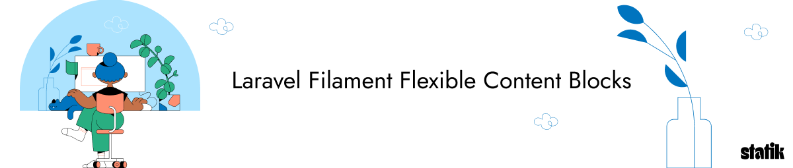

<p align="center"></p>

# Laravel Filament Flexible Content Blocks

[](https://packagist.org/packages/statikbe/laravel-filament-flexible-content-blocks)
[](https://github.com/statikbe/laravel-filament-flexible-content-blocks/actions?query=workflow%3Arun-tests+branch%3Amain)
[](https://github.com/statikbe/laravel-filament-flexible-content-blocks/actions?query=workflow%3A"Fix+PHP+code+style+issues"+branch%3Amain)
[](https://packagist.org/packages/statikbe/laravel-filament-flexible-content-blocks)

The Laravel Filament Flexible Content Blocks package helps you to easily create content in Filament for any 
model, with predefined blocks, and foreach block an extendable Blade view component. 

You can use this opinionated package to create a basic CMS, by setting up your own page model and implementing the predefined traits to 
select the functionality you need, then quickly setup a Filament resource by implementing the ready-made fields. Or you can 
add flexible content to a model for your specific business case, for instance to allow the flexible creation of a 
product description. Each project is different and to foster changing requirements, the focus is on the building blocks and 
not a default implementation for a CMS-like page.

The key goals of this package are:
- provide a quick way to add content to a model through reusable fields and content blocks
- quickly set up the frontend and allow different frontend stylings for each block
- have fully-working, extendable Blade view components with basic Tailwind styling 
- allow the liberty to pick and choose which fields and blocks you need for your requirements
- provide easy configuration to override the behaviour of the fields, blocks and image conversions
- support SEO
- support overview fields to display the content in a list with custom title, image and description
- support content translations
- provide a start set of content blocks for most general requirements

## Installation

You can install the package via composer:

```bash
composer require statikbe/laravel-filament-flexible-content-blocks
```

You will most likely need to edit [the extensive configuration](#configuration), so you can publish the config file with:

```bash
php artisan vendor:publish --tag="filament-flexible-content-blocks-config"
```

Optionally, you can publish the views (e.g. if you want to tweak the content blocks) using:

```bash
php artisan vendor:publish --tag="filament-flexible-content-blocks-views"
```

Since you can apply the flexible content blocks to any view, we do not provide required or default migrations. 
However, we provide two example migrations, one for a translatable page and one for a single-language page. 
You can use these migrations as an example to create your own migrations. (see [ToDo's](#todo))
You can publish and run the migrations with:

```bash
php artisan vendor:publish --tag="filament-flexible-content-blocks-migrations"
#first edit the migrations and then run:
php artisan migrate
```

## Dependencies

This is an opinionated package with batteries included. So we picked a set of dependencies to build upon. 
Here is a brief overview of the choices made:

- `filament/filament`: obviously ;-) 
- `spatie/laravel-medialibrary` & `filament/spatie-laravel-media-library-plugin`: all image handling is done with `spatie/medialibrary` 
- `spatie/laravel-sluggable`: for slugs
- `spatie/laravel-translatable`: for translations as this works together with the first party filament translatable package. 

## Usage

There is [an example implementation](./example) of all the package features, which includes:
- migrations
- data models
- Filament resources & pages
- Http controllers
- views

You can use this as a starting point to see how the package can be used for a simple page (there are two models for both regular and translated content). 
Below we briefly discuss how to setup a migration, a model and a Filament resource in four steps. In the future,
we want to add question-based commands to create these, see [roadmap](#roadmap).

### 1. Setup migrations

You can start from [the example migrations that can be published](#installation). Then prune and pick the fields that fit
your requirements, note that some model traits need a combination of fields, e.g. the hero image needs both `hero_image_copyright` and
`hero_image_title`. The clusters are commented in the migration or have a look in [the model traits](src/Models/Concerns) to get an idea.

### 2. Setup the model

If you do not have a model yet, create one with `php artisan make:model`, then you can add the interfaces and its default
implementation via traits. Below is an overview of the provided interfaces and traits and their functionality:

#### __[HasPageAttributes](src%2FModels%2FContracts%2FHasPageAttributes.php)__:
This adds a title and publishing begin and end date variables, together with functions and scopes to help with
finding published models. Implement this interface with the trait [HasPageAttributesTrait](src%2FModels%2FConcerns%2FHasPageAttributesTrait.php) 
or [HasTranslatedPageAttributesTrait](src%2FModels%2FConcerns%2FHasTranslatedPageAttributesTrait.php). 
for translated content.

#### __[HasIntroAttribute](src%2FModels%2FContracts%2FHasIntroAttribute.php)__:
This adds an introduction text variable. Implement this interface with the trait [HasIntroAttributeTrait](src%2FModels%2FConcerns%2FHasIntroAttributeTrait.php) 
or [HasTranslatedIntroAttributeTrait](src%2FModels%2FConcerns%2FHasTranslatedIntroAttributeTrait.php).

#### __[HasCode](src%2FModels%2FContracts%2FHasCode.php)__:
Adds a code variable to be able to select a specific content model in your source code by string instead of a 
varying id or slug. For instance, this is useful to look up a home page. Implement this with the trait [HasCodeTrait](src%2FModels%2FConcerns%2FHasCodeTrait.php).

#### __[HasHeroImageAttributes](src%2FModels%2FContracts%2FHasHeroImageAttributes.php)__:
Adds a hero image as well as a title (e.g. for accessibility in `alt` tags) and copyright variable to the model. This can 
be implemented with [HasHeroImageAttributesTrait](src%2FModels%2FConcerns%2FHasHeroImageAttributesTrait.php) and 
[HasTranslatedHeroImageAttributesTrait](src%2FModels%2FConcerns%2FHasTranslatedHeroImageAttributesTrait.php). 

#### __[HasContentBlocks](src%2FModels%2FContracts%2FHasContentBlocks.php)__:
Adds a JSON column to your model to store the data of the flexible content blocks. 
This is required if you want to use the flexible content blocks. Implement it with 
[HasContentBlocksTrait](src%2FModels%2FConcerns%2FHasContentBlocksTrait.php) or 
[HasTranslatedContentBlocksTrait](src%2FModels%2FConcerns%2FHasTranslatedContentBlocksTrait.php).

#### __[HasMediaAttributes](src%2FModels%2FContracts%2FHasMediaAttributes.php)__:
Always include this interface if you use any image functionality. It provides some helper functions. 
You do not need to add traits, since the trait will be included by other traits that handle images.

#### __[HasOverviewAttributes](src%2FModels%2FContracts%2FHasOverviewAttributes.php)__:
Overview fields can be used to display the content models as brief snippets in lists, for instance a list of news articles.
Implement this with [HasOverviewAttributesTrait](src%2FModels%2FConcerns%2FHasOverviewAttributesTrait.php) or 
[HasTranslatedOverviewAttributesTrait](src%2FModels%2FConcerns%2FHasTranslatedOverviewAttributesTrait.php).

#### __[HasSEOAttributes](src%2FModels%2FContracts%2FHasSEOAttributes.php)__:
This adds a new title, description, image and keywords for SEO. It provides fallbacks to the regular title, intro 
and hero image if no SEO fields are completed. Implement the 
[HasSEOAttributesTrait](src%2FModels%2FConcerns%2FHasSEOAttributesTrait.php) or the
[HasTranslatedSEOAttributesTrait](src%2FModels%2FConcerns%2FHasTranslatedSEOAttributesTrait.php) for translatable content.   

#### __[Linkable](src%2FModels%2FContracts%2FLinkable.php)__:
Add this interface if you want to use the model to link in call-to-actions to create dynamic URL's, or if you want to
use the view action in the Filament table. The interface asks you to implement two functions one to get the url where the 
content can be publicly viewed and another to view the unpublished content. 
There is no default implementation trait, because this package is unaware of the used routes and controllers.

### 3. Setup the Filament resource

Create a filament resource and its page with the filament command.

#### Setup the table

There are few column fields provided by the package. Below is an overview of all available columns in a code sample: 

```php
public static function table(Table $table): Table {
    return $table->columns([
            TitleColumn::create(),
            PublishedColumn::create(),
        ])
        ->actions([
            Tables\Actions\EditAction::make(),
            PublishAction::make(),
        ])
        ->bulkActions([
            Tables\Actions\DeleteBulkAction::make(),
        ]);
}
```

And then you can implement the `form()` function with Filament fields provided by the package. Below is an example with tabs.
Note that we sometimes make use of `create()` static functions, because we want to set the 
names to the fixed variables used in the models. Some fields in the example are bundled in groupings 
(e.g. [SEOFields](src%2FFilament%2FForm%2FFields%2FGroups%2FSEOFields.php)), you can also use the single fields if you 
want make a custom layout.

```php
public static function form(Form $form): Form {
    return $form
        ->schema([
            Tabs::make('Heading')
                ->columnSpan(2)
                ->tabs([
                    Tab::make('General')
                        ->schema([
                            TitleField::create(true),
                            SlugField::create(),
                            PublicationSection::create(),
                            AuthorField::create(),
                            HeroImageSection::create(),
                            IntroField::create(),
                        ]),
                    Tab::make('Content')
                        ->schema([
                            ContentBlocksField::create(),
                        ]),
                    Tab::make('Overview')
                        ->schema([
                            OverviewFields::make(1),
                        ]),
                    Tab::make('SEO')
                        ->schema([
                            SEOFields::make(1),
                        ]),
                ]),    
        ]);
}
```

If you have translatable content, you need to include the traits and language switch field of the [`filament/spatie-laravel-translatable-plugin`](https://filamentphp.com/docs/2.x/spatie-laravel-translatable-plugin/installation) to 
[the resource](https://filamentphp.com/docs/2.x/spatie-laravel-translatable-plugin/getting-started#preparing-your-resource-class) 
and its [pages](https://filamentphp.com/docs/2.x/spatie-laravel-translatable-plugin/getting-started#making-resource-pages-translatable).  

### 4. Setup the controller and Blade view

Now you need to create a controller and `GET` route that returns a Blade view to display your content. See the example code for [controller examples](example%2Fapp%2FHttp).

We provide Blade components for all fields (except SEO & overview fields). Below is an example of a simple Blade template, 
where the model is passed to this view as `$page` variable. The `<x-flexible-hero>` component renders a default hero with 
title and full screen image, and the `<x-flexible-content-blocks>` component renders all the content of each block.

__Note:__ The `x-flexible-hero` component requires [Alpine.js](https://alpinejs.dev/).  

```html
<x-layouts.flexible title="{{ $page->title }}" wide="true">
    <x-flexible-hero :page="$page" />
    <div>
        <x-flexible-content-blocks :page="$page">
        </x-flexible-content-blocks>
    </div>
</x-layouts.flexible>
```

If you want to customise these component views, you can [publish the views](#installation).

## Blocks

To build your content, the package provides the default blocks listed below. 

### Text block


### Text with image block

### Image block

### Video block

### Quote block

### HTML block

### Call-to-action block

### Overview block

### Cards block

### Template block

### Create your own custom block

You can easily create your own content block by extending [AbstractContentBlock](src%2FContentBlocks%2FAbstractContentBlock.php).

__Note:__ Do NOT use [AbstractFilamentFlexibleContentBlock.php](src%2FContentBlocks%2FAbstractFilamentFlexibleContentBlock.php)
to extend from, because this super class contains logic to add the package's own namespace to the custom block.

## Configuration

Documentation is WIP.


## Roadmap

Below is a list of ideas and missing features. PR's are welcome!

- Command to generate migrations
- Command to generate models
- Command to generate Filament resource and pages
- Integrate image asset manager
- Store links to models in rich editor
- Redirects
- Reusable blocks. Name: global block?
- Focal point for image resizing

## Changelog

Please see [CHANGELOG](CHANGELOG.md) for more information on what has changed recently.

## Contributing

Please, submit bugs or feature requests via the [Github issues](https://github.com/statikbe/laravel-filament-chained-translation-manager/issues).
Pull requests are welcomed! Thanks!

## Security Vulnerabilities

Please review [our security policy](../../security/policy) on how to report security vulnerabilities.

## Credits

- [Sten Govaerts](https://github.com/sten)
- [Stijn Elskens](https://github.com/stijnelskens)
- [All Contributors](../../contributors)

## License

The MIT License (MIT). Please see [License File](LICENSE.md) for more information.
